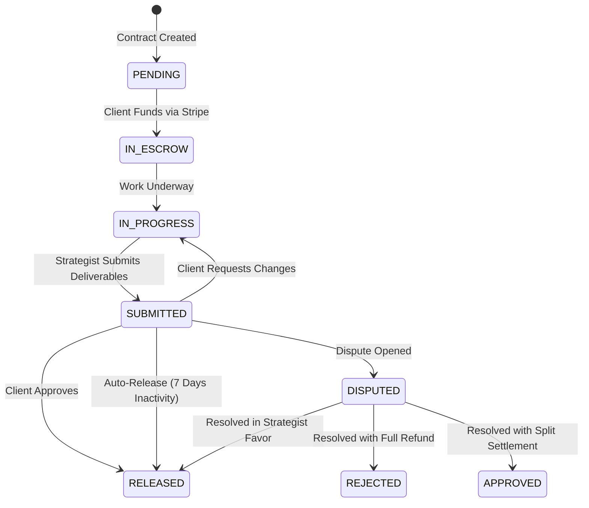

# Payments, Escrow, and Double-Entry Ledger Architecture

This document describes the financial architecture, escrow state machine, double-entry ledger, invoicing, and Stripe test-mode walkthrough for Loopwise.

---

## 1. Accounting Philosophy: Zero-Drift Double-Entry Ledger

All financial movements on Loopwise are recorded through a single transactional service: [`src/server/services/ledger.js`](file:///d:/the-c-drive-content/LOOPWISE/src/server/services/ledger.js).

### Ledger Accounts

- `CLIENT_FUNDS` (Asset): Inbound gross receipts from client checkout or payment intents.
- `ESCROW` (Liability): Funds held in trust pending deliverable milestone completion.
- `PLATFORM_REVENUE` (Revenue): Commission fees realized by Loopwise (client fee + strategist fee).
- `STRATEGIST_PAYABLE` (Liability): Available, cleared balance ready for strategist withdrawal.
- `PAYOUTS` (Asset/Contra): Outgoing settlement transfers via Stripe Connect to strategist bank accounts.
- `REFUNDS` (Asset/Contra): Returned payments back to client cards/bank accounts.

### Precision & Minor Units

- All amounts in the ledger are stored in integer **minor units (cents)**.
- Every transaction enforces the fundamental accounting equation:
  $$\sum \text{DEBIT} = \sum \text{CREDIT}$$

---

## 2. Transparent Fee Rules

Fee rules live in [`src/lib/fees.js`](file:///d:/the-c-drive-content/LOOPWISE/src/lib/fees.js):

- **Client Platform Fee**: 8% default (overrideable via `CLIENT_FEE_PCT`)
- **Strategist Platform Fee**: 10% default (overrideable via `STRATEGIST_FEE_PCT`)

### Invariant Proof

For a milestone of base amount $B$:

- Client charged: $C = B + \text{round}(B \times 0.08)$
- Strategist receives: $S = B - \text{round}(B \times 0.10)$
- Platform revenue: $P = \text{round}(B \times 0.08) + \text{round}(B \times 0.10)$
- **Invariant**: $C = S + P$ (zero lost cents).

---

## 3. Core Transaction Flows

### Flow 1: Milestone Funding (Into Escrow)

When client pays $1,000 milestone ($1,080 total):

1. `DEBIT CLIENT_FUNDS`: 108,000 cents
2. `CREDIT ESCROW`: 100,000 cents
3. `CREDIT PLATFORM_REVENUE`: 8,000 cents

### Flow 2: Milestone Approval & Escrow Release

When client approves submitted work:

1. `DEBIT ESCROW`: 100,000 cents
2. `CREDIT STRATEGIST_PAYABLE`: 90,000 cents
3. `CREDIT PLATFORM_REVENUE`: 10,000 cents

### Flow 3: Strategist Payout (Withdrawal)

When strategist withdraws $900 via Stripe Connect:

1. `DEBIT STRATEGIST_PAYABLE`: 90,000 cents
2. `CREDIT PAYOUTS`: 90,000 cents

### Flow 4: Monthly Retainer Billing

Client pays $5,000/mo retainer ($5,400 total):

1. `DEBIT CLIENT_FUNDS`: 540,000 cents
2. `CREDIT STRATEGIST_PAYABLE`: 450,000 cents
3. `CREDIT PLATFORM_REVENUE`: 90,000 cents

### Flow 5: Escrow Dispute Resolution

In the event of an escrow dispute resolved with a 60/40 split ($1,200 client refund, $800 strategist payout on $2,000 escrow):

1. `DEBIT ESCROW`: 200,000 cents
2. `CREDIT REFUNDS`: 120,000 cents
3. `CREDIT STRATEGIST_PAYABLE`: 80,000 cents

---

## 4. Escrow State Machine & Auto-Release

Milestones transition through:

### Automated Escrow Auto-Release Cron

- Route: [`GET /api/cron/escrow`](file:///d:/the-c-drive-content/LOOPWISE/src/app/api/cron/escrow/route.js)
- Runs daily via cron schedule.
- Any milestone in `SUBMITTED` state whose `autoReleaseAt <= now()` and has no open dispute is automatically released to the strategist.

---

## 5. Stripe Test-Mode Walkthrough & Test Cards

Loopwise includes an interactive test checkout at `/api/payments/test-checkout` that works seamlessly in local development and test environments.

### Standard Test Cards (Visa / Mastercard)

| Card Type                  | Card Number           | Expiry     | CVC   | Expected Result            |
| :------------------------- | :-------------------- | :--------- | :---- | :------------------------- |
| **Standard Success**       | `4242 4242 4242 4242` | Any future | `123` | Immediate checkout success |
| **Requires 3DS Auth**      | `4000 0027 6000 3184` | Any future | `123` | Prompts 3D Secure modal    |
| **Insufficient Funds**     | `4000 0000 0000 0002` | Any future | `123` | Fails with `card_declined` |
| **Stripe Connect Express** | `acct_test_...`       | —          | —     | Test payout transfer       |

### Step-by-Step Walkthrough:

1. **Fund Milestone**: In the client engagement workspace, switch to the **Escrow & Money** tab and click **Fund into Escrow**.
2. **Authorize Payment**: Complete authorization on the Stripe Checkout page using test card `4242 4242 4242 4242`.
3. **Escrow Locked**: Milestone status updates to `IN_ESCROW`.
4. **Deliverable Submission**: Strategist clicks **Submit Deliverables** and enters completion notes and artifact links. Status becomes `SUBMITTED`.
5. **Client Approval**: Client clicks **Approve & Release**. Funds move from `ESCROW` to `STRATEGIST_PAYABLE`.
6. **Withdrawal**: In `/strategist/earnings`, the strategist views the available balance and clicks **Withdraw Earnings** to initiate a Stripe Connect transfer.
